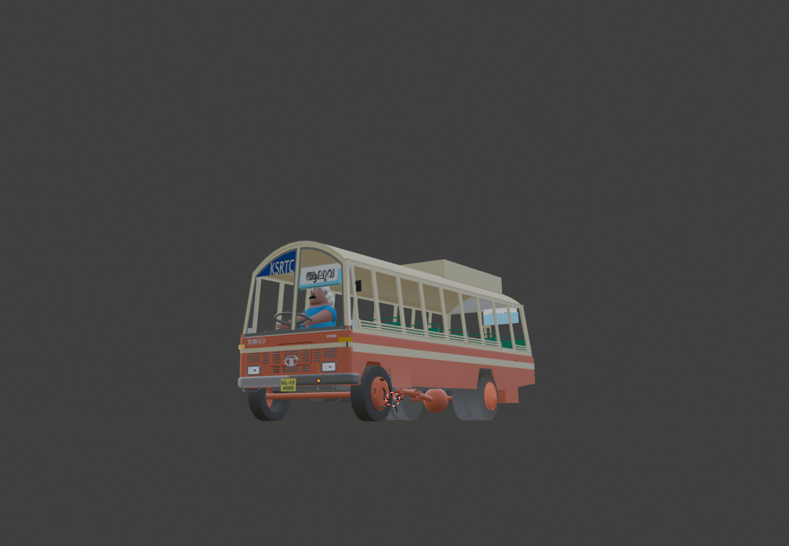

# SKT Kart For KSRTC

<b>NB</b>: WIP

Nothing special, just a binary dump (🙃) of a KSRTC (Kerala State Road Transport Corporation) Kart developed for SuperTuxkart, by a Blender Noob.

## To Dos

- Migrate to appropriate version controller, like subversion (I admit Git is a terrible
place for version control binary files. Anywho I'm too lazy to learn SVN or other mangers rn (feel free to contribute)
- Fix rear wheel texture baking issues and other baking glitches.
- Add STK character animations.
- Make it pretty, and more cartoonish
- Adding shadows and other properties.
- A good character (driver)
- Package and push to STK Addons. :)

## Installation

(Currently the model is not available under public addons at STK)

1. Download and extract the latest release file from [releases](https://github.com/bruttazz/kart-ksrtc/releases/latest). (eg: `ksrtc_vX.X.X.zip`)
2. Rename the extracted directory to `ksrtc`
3. Move the directory to the OS specific STK add-on directory (create the parent directory if not already exists).
  - On Linux: `~/.local/share/supertuxkart/addons/karts`
  - On Windows: `%APPDATA%/supertuxkart/addons/karts`
  - On macOS: `~/Library/Application Support/supertuxkart/addons/karts`
4. Open SuperTuxkart and find the kart under standard karts (:))

for more info refer [stk testing docs](https://supertuxkart.net/Making_Karts:_Testing)

## Development

### Tooling
- Blender 3.8 or above
- [SuperTuxKart Blender Addons](https://github.com/supertuxkart/stk-blender) for `.spm` export
- Documentation: The [STK kart's doc](https://supertuxkart.net/Making_Karts)

#### Character

- No comments on The character. The current one is made by doing some slight modification to the existing Phil model created by Blender Studio.
The model is named *Vasu*. Will be great if you can keep the name. Otherwise feel free to add a female character with any name of choice.

> The character *Vasu* or the slightly cartoonized model of KSRTC bus, doesn't indent to harm or disfame any person / organization. The character's look and features are completely
random and are not following any stereotypes.

#### Developing the Bus
- Final blender model used to export the kart (having baked textures) can be found under `./blends/cartoonish_with_vasu/cartoonish_with_vasu.blend`
  - There was an issue with the existing character model, causing colour change in the exported `.spm` file on using STK-Addon.
  To avoid, try to export the kart elements (excluding headlights, and wheels) to `.spm`
  format separately by unchecking `Export Vertex Colors`.

- The realistic kart model (doesn't match with the style of other karts ( as it's too long :)) can be found under `./blends/actual_ratio/actual_ratio_export.blend`

## Credits

- Base model of KSRTC by [Anandhukrishnan](https://sketchfab.com/3d-models/ksrtc-fbx-511514fc3444477d91116eed452d882c) ( licensed under CC )
- The base character model [Phil](https://studio.blender.org/characters/phil/v1/) by Blender Studio ( licensed under CC By 4.0 )
- [KeralaSRTC](https://www.keralartc.com/)
- Made in [Blender](https://www.blender.org/)
- [SuperTuxKart Blender Addons](https://github.com/supertuxkart/stk-blender)
- Idea developed from [Kochi FOSS](https://kochifoss.org/)

## License
- License text for kart : [LICENSE.kart](./LICENSE.kart)
- All binary files used in [SKT Kart For KSRTC by Agraj P Das is marked with CC0 1.0 Universal](./LICENSE.CC.html)
- The rest of the repo is licensed under [MIT License](./LICENSE.MIT)

## Gallery

