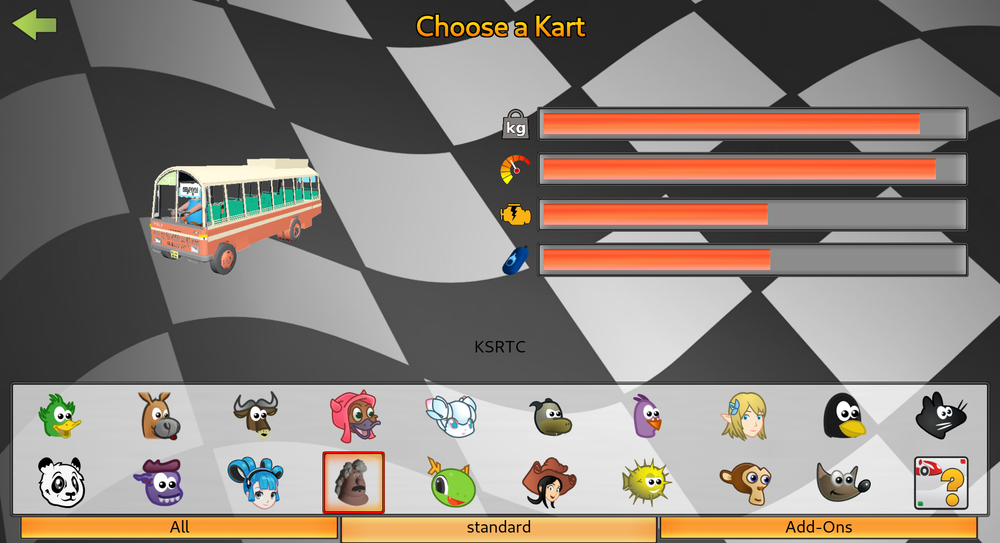

# SKT Kart For KSRTC

<b>NB</b>: WIP

Nothing special, just a binary dump (🙃) of a KSRTC (Kerala State Road Transport Corporation) Kart developed for SuperTuxkart, Created by a Blender Noob.

## To Dos

- Using appropriate version controller, like subversion (I know Git is not a perfect
place to version control binary files. Anywho I'm soo lazy to learn SVN or other mangers rn (feel free to contribute)
- Add animations for (victory, failure, waiting, etc)
- Package and push to STK Addons. :)
- Make it pretty, and more cartoonish (I've tried my best with the limited artistic abilities of mine)
- Make it trade mark independent ( If possible )
- Adding shadows and other properties.
- What ever improvements make the mod better
- A good character and things

## Installation

Currently the model is not available under public addons in STK

1. Download and extract the latest release file from [releases](https://github.com/bruttazz/kart-ksrtc/releases/latest). (eg: `ksrtc_vX.X.X.zip`)
2. Rename the extracted directory to `ksrtc`
3. Move the file to your OS specific directory (create the parent directory if not already exists).
  - On Linux: `~/.local/share/supertuxkart/addons/karts`
  - On Windows: `%APPDATA%/supertuxkart/addons/karts`
  - On macOS: `~/Library/Application Support/supertuxkart/addons/karts`
4. Open SuperTuxkart, and find the kart under standard karts (:))

more more info refer : [stk testing docs](https://supertuxkart.net/Making_Karts:_Testing)

## Development

### Tooling
- Blender 3.8 or above
- [SuperTuxKart Blender Addons](https://github.com/supertuxkart/stk-blender) for .spm conversion
- The [STK kart's doc](https://supertuxkart.net/Making_Karts) will help

#### Character

- No comments on The character. The current one is made by doing some slight modification to the existing Phil model created by Blender Studio.
The model is named *Vasu*. Will be great if you can keep the name. Otherwise feel free to add a female character with any name of choice.

> The character *Vasu* or the slightly cartoonised model of KSRTC bus, doesn't mean to harm or disfame anyone. The character's look is completely
random and not intended to follow any stereotypes.

#### Developing the Bus
- Final blender model used to export the kart to STK (having baked textures) can be found under `./blends/cartoonish_with_vasu/cartoonish_with_vasu.blend`
  - There was an issue with the existing character model to cause color change in `.spm` format under direct export using STK-Addon.
  Try to export the cart elements (excluding headlights, and wheels) to `.spm`
  format separately by unchecking `Export Vertex Colors`.

- The realistic model (having some issue to fit into other karts in the game (is too long :)) can be found under `./blends/actual_ratio/actual_ratio_export.blend`

- Both of these models are created after some series of object joining and baking processes for this particular export. Feel free to ping me to get
any intermediary blends if needed.

## Credits

- Base model of KSRTC created by [Anandhukrishnan](https://sketchfab.com/3d-models/ksrtc-fbx-511514fc3444477d91116eed452d882c) is licensed under CC.
- The base character model [Phil](https://studio.blender.org/characters/phil/v1/) by Blender Studio is licensed under CC By 4.0
- [KeralaSRTC](https://www.keralartc.com/)
- Created in [Blender](https://www.blender.org/)
- Using [SuperTuxKart Blender Addons](https://github.com/supertuxkart/stk-blender)
- Idea developed from [Kochi FOSS](https://kochifoss.org/)
- [TATA Motors](https://www.tatamotors.com/) for their trade mark (inherited from the original model)

## License
- License text for [KSRTC Kart](./LICENSE.kart)
- All binary files used under [SKT Kart For KSRTC by Agraj P Das is marked with CC0 1.0 Universal](./LICENSE.CC.html)
- The rest of the repo is licensed under [MIT License](./LICENSE.MIT)

## Gallery

